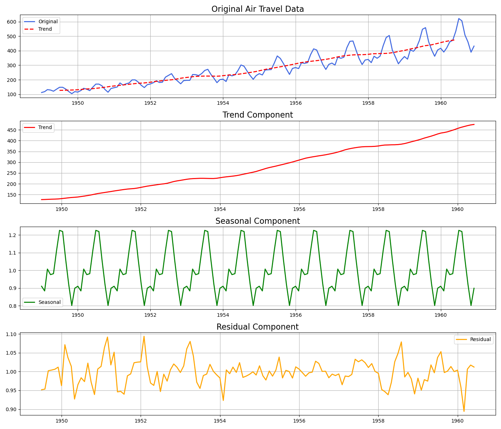
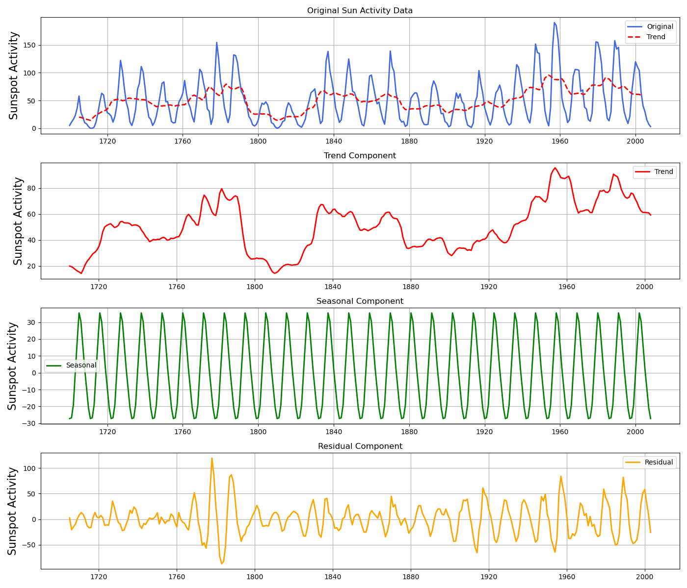

# Time Series Analysis & Forecasting

## try-it-10.1-starter
The aim of this project is to showcase the application of time series decomposition, highlighting the differences and similarities between a naturally occurring series (sunspots) and one influenced by human behavior (air passenger counts).

Using `seasonal_decompose` from `statsmodels`, we decomposed each time series to its trend, seasonal, and residual components. This approach provided insights into the cyclic nature of sunspots contrasted with the growth trend in air passenger numbers.

The following graphs highlight the decomposed components of each dataset:

### Air Passenger Volume

### Sunspot Activity

This exercise underscores the importance of understanding the nature of the data when applying time series analysis. While both datasets exhibit clear patterns, the drivers behind these patterns differ significantly, influencing the choice of decomposition method and interpretation of results.

