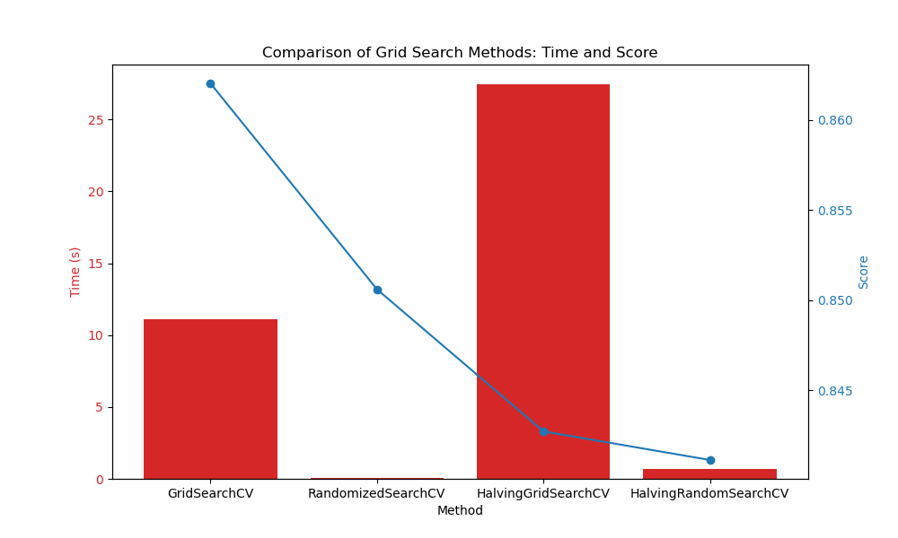

# GridSearching Decision Trees

We used GridSearch for decision trees to find the best hyperparameters. GridSearch can become computationally expensive very quickly with tree models due to the large number of possible hyperparameter combinations. We compared the time taken and the score for different search methods to evaluate their efficiency and accuracy.

| Method                  | Time (seconds) | Score    |
|-------------------------|----------------|----------|
| GridSearchCV            | 11.315509      | 0.862036 |
| RandomizedSearchCV      | 0.053251       | 0.861559 |
| HalvingGridSearchCV     | 27.611962      | 0.850591 |
| HalvingRandomSearchCV   | 0.680731       | 0.841142 |
### Summary of Findings 
1. GridSearchCV yield the best score as expected but surprisingly does not take the longest to fit.
2. Thought along with GridSearchCV, RandomizedSearchCV score are both the best score with GridSearchCV but taken a bit shorter than GridSearch.
3. Both HalvingGridSearchCV and HalvingRandomSearchCV score quite poorly.
4. The clear winner here is **RandomizedSearchCV**. Taking lower time and score the highest

For more details on how these methods work and how to implement them, refer to the [scikit-learn documentation on hyperparameter tuning](https://scikit-learn.org/stable/modules/grid_search.html).
