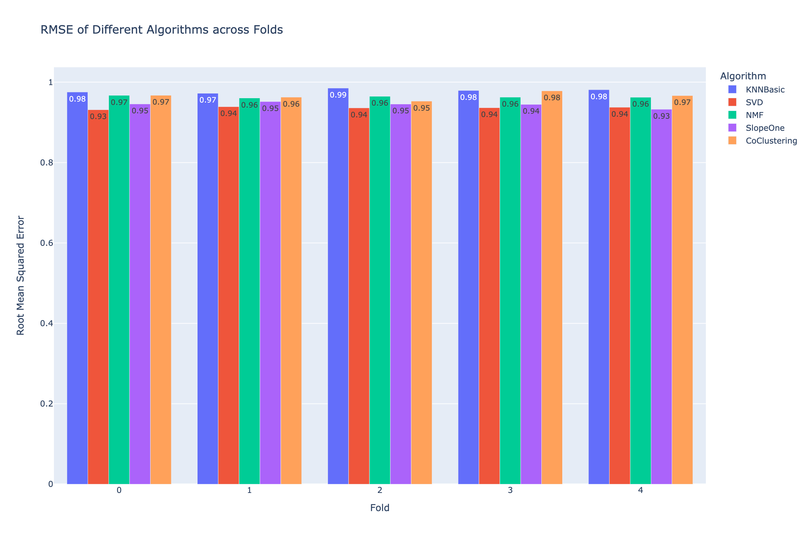
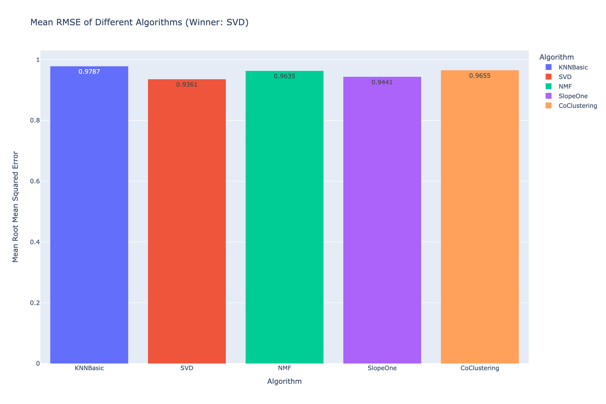

# MovieLens Recommendation Algorithms Comparison

This project compares the performance of various recommendation algorithms using the MovieLens 100K dataset. The goal is to identify the optimal algorithm by minimizing the mean squared error (RMSE) using cross-validation.

## Dataset

The [MovieLens 100K](https://grouplens.org/datasets/movielens/100k/) dataset contains 100,000 ratings (1-5) from 943 users on 1682 movies. Each user has rated at least 20 movies.

## Algorithms

The following algorithms from the `Surprise` library were compared:
- KNNBasic
- SVD
- NMF
- SlopeOne
- CoClustering

## Evaluation

The performance of each algorithm was evaluated using 5-fold cross-validation. The primary metric used is the Root Mean Squared Error (RMSE).

## Results

### RMSE Across Folds

The following bar chart shows the RMSE of different algorithms across the five cross-validation folds:



### Mean RMSE

The following bar chart shows the mean RMSE of different algorithms. SVD had the lowest mean RMSE, indicating it is the most accurate algorithm for this dataset.



### Key Findings

- **SVD** consistently outperforms the other algorithms across all folds, achieving the lowest RMSE values. This indicates that SVD is the most accurate algorithm for predicting movie ratings in this dataset.
- **SlopeOne** and **NMF** also perform well, but not as consistently as SVD. They have slightly higher RMSE values, indicating marginally less accuracy.
- **KNNBasic** and **CoClustering** have higher RMSE values compared to SVD, NMF, and SlopeOne, suggesting that these algorithms are less accurate for this specific recommendation task.
- The performance of each algorithm is relatively consistent across different folds, indicating that the algorithms' performances are stable and reliable.

## How to Run

1. **Install Required Libraries**:
   Ensure you have the required libraries installed. You can install them using pip:

   ```bash
   pip install scikit-surprise plotly pandas
    ```
2. **Run the Jupyter Notebook**:
   Run the Jupyter notebook to see the results and compare the algorithms:

   ```bash
   jupyter notebook
    ```
3. **View the Results**:
   Explore the results of the cross-validation and the comparison of algorithms.
4. **Experiment and Improve**:
   Experiment with different algorithms and hyperparameters to improve the performance.
5. **Choose the Best Algorithm**: 
   Analyze the results and choose the best algorithm for the recommendation system.
6. **Implement in Production**:
    Implement the chosen algorithm in a production environment for real-time recommendations.
7. **Monitor and Evaluate**: 
    Monitor and evaluate the performance of the recommendation system over time.
8.  **Iterate and Improve**: 
    Iterate on the algorithm and data to improve the accuracy and relevance of recommendations.

