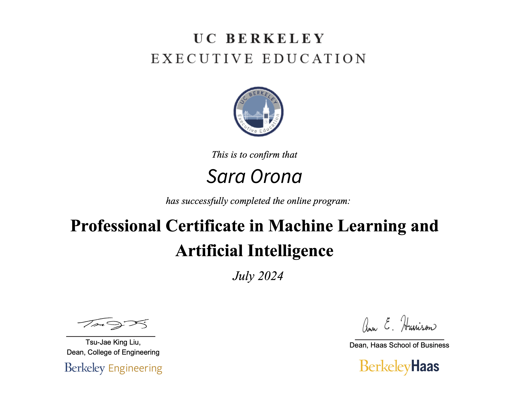

# University of California, Berkeley - Professional Certificate in Machine Learning and Artificial Intelligence

[Certificate Link](https://certificates.emeritus.org/37c82622-fb7b-4c09-8b24-f2f201270286) | [Program Information](https://exec-ed.berkeley.edu/professional-certificate-in-machine-learning-and-artificial-intelligence/)

---

## Overview

This repository showcases my learning journey through the UC Berkeley Professional Certificate in Machine Learning and Artificial Intelligence. It contains program details, key takeaways, and sample notebooks demonstrating the skills and tools I acquired during the program.

The **Professional Certificate in Machine Learning and Artificial Intelligence** from UC Berkeley (ranked the #1 university in the world by Forbes) is a prestigious program developed in collaboration with the **College of Engineering** and the **Haas School of Business**. This program offers hands-on experience solving real-world technical and business challenges using cutting-edge ML/AI tools and techniques.

Participants gain highly sought-after skills in:
- **Data Analysis**: Exploring and visualizing datasets to uncover insights.
- **Machine Learning**: Developing models to address complex problems.
- **Advanced AI Topics**: Applying concepts like NLP and Generative AI to real-world scenarios.

---

## 📚 Program Topics

### 💡 **Foundations of Machine Learning**  
- Core concepts and workflows, with an introduction to data analytics.  
- Key Modules:  
  - Introduction to Machine Learning  
  - Fundamentals of Statistics and Distribution Functions  
  - Introduction to Data Analytics  

### 🛠️ **ML Techniques**  
- Practical application of techniques like clustering, regression, and forecasting.  
- Key Modules:  
  - Clustering and PCA  
  - Feature Engineering and Overfitting  
  - Time Series Analysis and Forecasting  

### 🚀 **Advanced Topics & Capstone**  
- Exploration of NLP, Deep Learning, and Generative AI, culminating in a capstone project.  
- Key Modules:  
  - Natural Language Processing  
  - Deep Neural Networks I & II  
  - Generative AI  
  - Capstone Project  

---

## Tools & Technologies
- **Programming Languages**: Python  
- **Data Analysis & Visualization**: Jupyter, Pandas, Seaborn, Plotly  
- **Development Platforms**: Google Colab, Codio  
- **Version Control & Collaboration**: GitHub   

